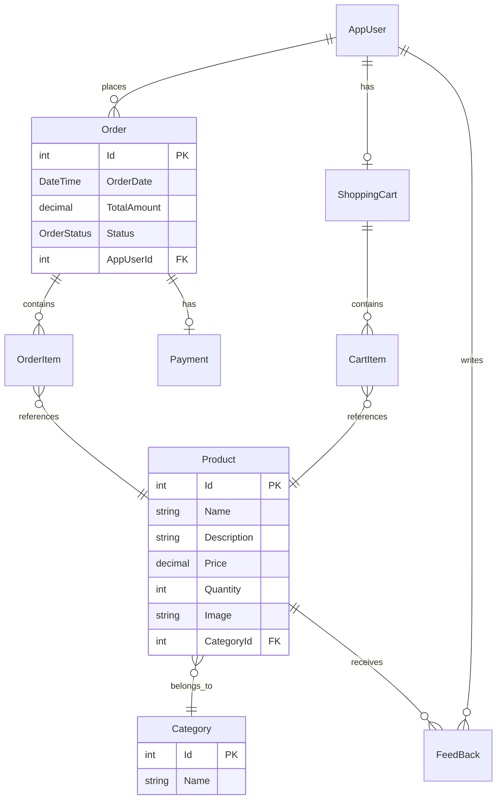

<p align="center">
  
  
  
  
  
  
</p>

<h1 align="center">🌐 TradeSphere API</h1>

<p align="center">
  <strong>A modern, scalable e-commerce REST API built with .NET 8 and Clean Architecture</strong>
</p>

<p align="center">
  <a href="#-features">Features</a> •
  <a href="#-architecture">Architecture</a> •
  <a href="#-getting-started">Getting Started</a> •
  <a href="#-api-endpoints">API Endpoints</a> •
  <a href="#-project-structure">Project Structure</a> •
  <a href="#-technologies">Technologies</a> •
  <a href="#-contributing">Contributing</a>
</p>

---

## 📋 Overview

**TradeSphere** is a full-featured e-commerce backend API that provides comprehensive functionality for online retail operations. Built following Clean Architecture principles, it offers a robust foundation for building scalable shopping platforms with features like product management, order processing, shopping cart functionality, user authentication, and payment processing.

### 🎯 Problem It Solves

TradeSphere addresses the need for a well-structured, maintainable e-commerce backend that:
- Handles complex business logic for online stores
- Provides secure user authentication and role-based access control
- Manages inventory, orders, and payments efficiently
- Offers a clean, documented API for frontend integration

---

## ✨ Features

### 🔐 Authentication & Authorization
- **JWT-based Authentication** - Secure token-based authentication system
- **Refresh Token Support** - Long-lived sessions with token refresh capability
- **Role-Based Access Control** - Admin and User role management
- **Email Verification** - Account verification via email

### 🛍️ Product Management
- Full CRUD operations for products
- Category organization and filtering
- Product image support
- Inventory tracking

### 🛒 Shopping Cart
- Add/remove items from cart
- Quantity management
- Cart persistence per user
- Real-time price calculations

### 📦 Order Management
- Order creation from cart
- Order status tracking (Pending → Processing → Shipped → Delivered)
- Order history per user
- Order cancellation support

### 💳 Payment Processing
- Payment recording and tracking
- Multiple payment method support
- Payment status management

### 📝 Customer Feedback
- Product rating and reviews
- Feedback management

---

## 🏗️ Architecture

TradeSphere follows **Clean Architecture** principles, ensuring separation of concerns and maintainability:

```
┌─────────────────────────────────────────────────────────────┐
│                      TradeSphere.Api                        │
│              (Controllers, Middleware, Config)              │
├─────────────────────────────────────────────────────────────┤
│                  TradeSphere.Application                    │
│            (Use Cases, DTOs, Interfaces, Mapping)           │
├─────────────────────────────────────────────────────────────┤
│                  TradeSphere.Infrastructure                 │
│     (Repositories, Persistence, Services, Unit of Work)     │
├─────────────────────────────────────────────────────────────┤
│                     TradeSphere.Domain                      │
│                  (Entities, Business Rules)                 │
└─────────────────────────────────────────────────────────────┘
```

### Layer Responsibilities

| Layer | Responsibility |
|-------|----------------|
| **Api** | HTTP endpoints, middleware, dependency injection setup |
| **Application** | Business logic orchestration, DTOs, service interfaces |
| **Infrastructure** | Data access, external services, repository implementations |
| **Domain** | Core entities, enums, business rules |

---

## 🚀 Getting Started

### Prerequisites

- [.NET 8 SDK](https://dotnet.microsoft.com/download/dotnet/8.0)
- [SQL Server](https://www.microsoft.com/en-us/sql-server) (or SQL Server Express/LocalDB)
- [Visual Studio 2022](https://visualstudio.microsoft.com/) or [VS Code](https://code.visualstudio.com/)

### Installation

1. **Clone the repository**
   ```bash
   git clone https://github.com/yourusername/TradeSphere.Api.git
   cd TradeSphere.Api
   ```

2. **Configure the database connection**
   
   Update `appsettings.json` with your SQL Server connection string:
   ```json
   {
     "ConnectionStrings": {
       "conn1": "Data Source=.;Initial Catalog=TradeSphere;Integrated Security=True;Encrypt=True;Trust Server Certificate=True;MultipleActiveResultSets=true"
     }
   }
   ```

3. **Configure JWT settings**
   ```json
   {
     "JwtOptions": {
       "issuer": "your-issuer",
       "audience": "your-audience",
       "secretKey": "your-secret-key-min-32-characters"
     }
   }
   ```

4. **Configure Email settings** (for verification emails)
   ```json
   {
     "EmailSettings": {
       "From": "your-email@gmail.com",
       "SmtpServer": "smtp.gmail.com",
       "Port": 587,
       "Username": "your-email@gmail.com",
       "Password": "your-app-password",
       "AppUrl": "https://localhost:7013"
     }
   }
   ```

5. **Run the application**
   ```bash
   dotnet restore
   dotnet build
   dotnet run --project TradeSphere.Api
   ```

6. **Access Swagger UI**
   
   Open your browser and navigate to: `https://localhost:7013/swagger`

> **Note:** The application automatically applies migrations and seeds initial data on startup.

---

## 📡 API Endpoints

### Authentication

| Method | Endpoint | Description |
|--------|----------|-------------|
| `POST` | `/api/Auth/register` | Register a new user |
| `POST` | `/api/Auth/login` | Login and receive JWT token |
| `POST` | `/api/Auth/refresh-token` | Refresh access token |
| `POST` | `/api/Auth/logout` | Logout user |

### Account

| Method | Endpoint | Description |
|--------|----------|-------------|
| `GET` | `/api/Account/profile` | Get current user profile |
| `PUT` | `/api/Account/profile` | Update user profile |

### Products

| Method | Endpoint | Description |
|--------|----------|-------------|
| `GET` | `/api/Product` | Get all products |
| `GET` | `/api/Product/{id}` | Get product by ID |
| `POST` | `/api/Product` | Create new product |
| `PUT` | `/api/Product/{id}` | Update product |
| `DELETE` | `/api/Product/{id}` | Delete product |

### Categories

| Method | Endpoint | Description |
|--------|----------|-------------|
| `GET` | `/api/Category` | Get all categories |
| `GET` | `/api/Category/{id}` | Get category by ID |
| `POST` | `/api/Category` | Create new category |
| `PUT` | `/api/Category/{id}` | Update category |
| `DELETE` | `/api/Category/{id}` | Delete category |

### Shopping Cart

| Method | Endpoint | Description |
|--------|----------|-------------|
| `GET` | `/api/ShoppingCart` | Get user's cart |
| `POST` | `/api/ShoppingCart/add` | Add item to cart |
| `PUT` | `/api/ShoppingCart/update` | Update cart item |
| `DELETE` | `/api/ShoppingCart/remove/{id}` | Remove item from cart |
| `DELETE` | `/api/ShoppingCart/clear` | Clear entire cart |

### Orders

| Method | Endpoint | Description |
|--------|----------|-------------|
| `GET` | `/api/Order` | Get user's orders |
| `GET` | `/api/Order/{id}` | Get order by ID |
| `POST` | `/api/Order` | Create new order |
| `PUT` | `/api/Order/{id}/status` | Update order status |
| `DELETE` | `/api/Order/{id}` | Cancel order |

### Roles (Admin)

| Method | Endpoint | Description |
|--------|----------|-------------|
| `GET` | `/api/Role` | Get all roles |
| `POST` | `/api/Role` | Create new role |
| `PUT` | `/api/Role/{id}` | Update role |
| `DELETE` | `/api/Role/{id}` | Delete role |

---

## 📁 Project Structure

```
TradeSphere.Api/
├── 📂 TradeSphere.Api/              # Presentation Layer
│   ├── Controllers/                  # API Controllers
│   │   ├── AccountController.cs
│   │   ├── AuthController.cs
│   │   ├── CategoryController.cs
│   │   ├── OrderController.cs
│   │   ├── ProductController.cs
│   │   ├── RoleController.cs
│   │   └── ShoppingCartController.cs
│   ├── Errors/                       # Custom error handling
│   ├── Extensions/                   # Service extensions
│   ├── Middlewares/                  # Custom middleware
│   └── Program.cs                    # Application entry point
│
├── 📂 TradeSphere.Application/       # Application Layer
│   ├── DTOs/                         # Data Transfer Objects
│   │   ├── AuthDto/
│   │   ├── Category/
│   │   ├── OrderDto/
│   │   ├── PaymentDto/
│   │   ├── ProductAddDto/
│   │   ├── RolesDto/
│   │   └── ShoppingCartDto/
│   ├── Interfaces/                   # Service & Repository Interfaces
│   │   ├── Repositories/
│   │   ├── Services/
│   │   ├── Specification/
│   │   └── UnitOfWork/
│   ├── Mapping/                      # AutoMapper profiles
│   └── UseCases/                     # Business logic
│       ├── AccountUseCase.cs
│       ├── AuthUseCase.cs
│       ├── CategoryUseCase.cs
│       ├── OrderUseCase.cs
│       ├── ProductUseCase.cs
│       ├── RoleUseCase.cs
│       └── ShoppingCartUseCase.cs
│
├── 📂 TradeSphere.Infrastructure/    # Infrastructure Layer
│   ├── Persistence/
│   │   ├── Configurations/           # EF Core entity configurations
│   │   ├── DbContext/                # Application DbContext
│   │   ├── Migrations/               # Database migrations
│   │   ├── SeedDataClass/            # Data seeding logic
│   │   └── SeedFiles/                # Seed data JSON files
│   ├── Repositories/                 # Repository implementations
│   ├── Services/                     # External service implementations
│   ├── Specification/                # Specification pattern
│   └── UnitOfWork/                   # Unit of Work implementation
│
└── 📂 TradeSphere.Domain/            # Domain Layer
    └── Models/
        ├── BaseEntity.cs
        ├── CartItem.cs
        ├── Category.cs
        ├── FeedBack.cs
        ├── Order.cs
        ├── OrderItem.cs
        ├── Payment.cs
        ├── Product.cs
        ├── ShoppingCart.cs
        └── IdentityUser/
            ├── AppRole.cs
            ├── AppUser.cs
            └── RefreshToken.cs
```

---

## 🛠️ Technologies

### Core Framework
| Technology | Version | Purpose |
|------------|---------|---------|
| .NET | 8.0 | Runtime & SDK |
| ASP.NET Core | 8.0 | Web API Framework |
| C# | 12 | Programming Language |

### Data Access
| Technology | Version | Purpose |
|------------|---------|---------|
| Entity Framework Core | 8.0.22 | ORM |
| SQL Server | - | Database |

### Security
| Technology | Version | Purpose |
|------------|---------|---------|
| ASP.NET Core Identity | 8.0 | User management |
| JWT Bearer | 8.0.22 | Token authentication |

### Tools & Libraries
| Technology | Version | Purpose |
|------------|---------|---------|
| AutoMapper | 13.0.1 | Object mapping |
| MailKit | 4.14.1 | Email service |
| Swashbuckle | 6.6.2 | Swagger/OpenAPI |

---

## 📊 Domain Model



---

## 🔧 Configuration

### Environment Variables

| Variable | Description | Required |
|----------|-------------|----------|
| `ConnectionStrings__conn1` | SQL Server connection string | ✅ |
| `JwtOptions__secretKey` | JWT signing key (min 32 chars) | ✅ |
| `JwtOptions__issuer` | JWT issuer | ✅ |
| `JwtOptions__audience` | JWT audience | ✅ |
| `EmailSettings__From` | Sender email address | ⚠️ |
| `EmailSettings__Username` | SMTP username | ⚠️ |
| `EmailSettings__Password` | SMTP password | ⚠️ |

---

## 🤝 Contributing

Contributions are welcome! Please follow these steps:

1. **Fork the repository**

2. **Create a feature branch**
   ```bash
   git checkout -b feature/AmazingFeature
   ```

3. **Commit your changes**
   ```bash
   git commit -m 'Add some AmazingFeature'
   ```

4. **Push to the branch**
   ```bash
   git push origin feature/AmazingFeature
   ```

5. **Open a Pull Request**

### Coding Standards

- Follow C# coding conventions
- Write meaningful commit messages
- Add XML documentation for public APIs
- Write unit tests for new features
- Ensure all tests pass before submitting PR

---

## 📄 License

This project is licensed under the **MIT License** - see the [LICENSE](LICENSE) file for details.

```
MIT License

Copyright (c) 2024 TradeSphere

Permission is hereby granted, free of charge, to any person obtaining a copy
of this software and associated documentation files (the "Software"), to deal
in the Software without restriction, including without limitation the rights
to use, copy, modify, merge, publish, distribute, sublicense, and/or sell
copies of the Software, and to permit persons to whom the Software is
furnished to do so, subject to the following conditions:

The above copyright notice and this permission notice shall be included in all
copies or substantial portions of the Software.

THE SOFTWARE IS PROVIDED "AS IS", WITHOUT WARRANTY OF ANY KIND, EXPRESS OR
IMPLIED, INCLUDING BUT NOT LIMITED TO THE WARRANTIES OF MERCHANTABILITY,
FITNESS FOR A PARTICULAR PURPOSE AND NONINFRINGEMENT.
```

---

<p align="center">
  Made with ❤️ using .NET 8
</p>

<p align="center">
  <a href="#-tradesphere-api">⬆️ Back to Top</a>
</p>